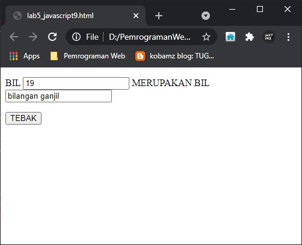

# Lab5Web
# Persiapan membuat dokumen HTML dengan nama file lab5_javascript.html seperti berikut. 
* input

* output

# Pemakaian Alert sebagai property window.
* input

* output

# Pemakaian method dalam objek.
* input

* output

# Pemakaian promt.
* input

* output

# Pembuatan fungsi dan cara pemanggilannya.
* input

* output 

# Operasi dasar aritmatika.
* input

* output

# Seleksi kondisi (iff...else)
* input

* output

# Penggunaan operator switch untuk seleksi kondisi
* input

* output

# Membuat form, form input.
* input

* output 

# Membuat form, form button.
* input

* output

# Pilihan dengan menggunakan checkbox dengan perhitungan otomatis
* input

* output

# Pertanyaan dan Tugas 
__1. Buat script untuk melakukan validasi pada isian form.__

__JAWAB__

* input

* output

